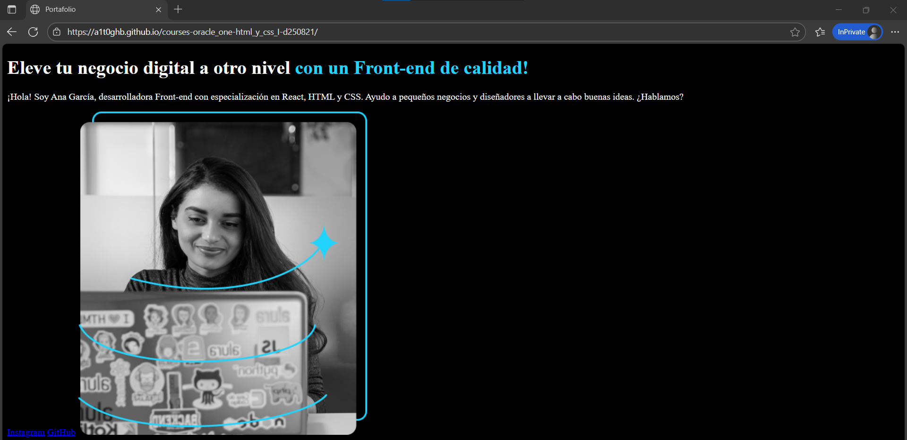

<!-- Badges:
- Source: 'https://shields.io/docs/static-badges', 'https://shields.io/badges/static-badge'.
- HTML structure followed: 'https://github.com/facebook/docusaurus/blob/main/README.md?plain=1'.
- Badges with logos: 'https://shields.io/docs/logos', 'https://simpleicons.org/', 'https://github.com/simple-icons/simple-icons/blob/master/slugs.md'.
- HTML <a> tag not redirecting: 'https://stackoverflow.com/questions/8260546/make-a-html-link-that-does-nothing-literally-nothing/8260561#8260561', 'https://www.geeksforgeeks.org/html/how-to-create-html-link-that-does-not-follow-the-link/'.
-->

<!-- Badge: WIP

  

-->

<!-- Badge: Done -->

  

<!-- README structure followed:
- 'https://www.aluracursos.com/blog/como-escribir-un-readme-increible-en-tu-github/'.
- 'https://github.com/camilafernanda/GlicoCare/'.
- 'https://github.com/nasa/openmct/'.
- 'https://github.com/facebook/docusaurus'.
-->

# Basics of HTML and CSS.

  🌐 '<a href="https://a1t0ghb.github.io/courses-oracle_one-html_y_css_I-d250821/">https://a1t0ghb.github.io/courses-oracle_one-html_y_css_I-d250821/</a>'

<!--
Enable autoplay of animated images:
- 'https://stackoverflow.com/questions/72508378/enable-gif-autoplay-on-github-readme/72509078#72509078'.
- 'https://github.com/orgs/community/discussions/47709'.
- 'https://github.com/settings/accessibility'.
Image width for GitHub READMEs:
- 'https://github.com/orgs/community/discussions/42424'.
- 'https://gist.github.com/uupaa/f77d2bcf4dc7a294d109'.
-->

  

Final delivery of the 7th course: '[HTML y CSS: ambientes de desarrollo, estructura de archivos y tags](https://app.aluracursos.com/course/html-css-desarrollo-estructura-archivos-tags)', from module (a.k.a. 'formación' in spanish) '[Principiante en Programación G9 - ONE](https://app.aluracursos.com/formacion-programacion-primeros-pasos-grupo9-one)', of [Alura LATAM](https://www.aluracursos.com/). <b>Part of [ORACLE Next Education (ONE)](https://www.oracle.com/co/education/oracle-next-education/) education program, in LATAM</b>.

<!-- Callouts:
- Improved format taken from examples in 'https://github.com/nasa/openmct/blob/master/README.md?plain=1'.
-->
> [!NOTE]
> This README is **mainly** written in english (en), but it might have some sections in spanish (sp), since course content is in spanish.

# ℹ About.

The course covered topics such as:

- **Creation of `index.html` file**.
- Basic HTML tags, such as `
`, `<h1>`, ``, `<a>`, etc.
- `<!DOCTYPE html>` special tag to indicate use of HTML5 vs. browser's 'Quirks Mode', for legacy and historical reasons.
- Concept of using [Figma](https://www.figma.com/) as web-tool in professional spaces to design and work in the **front-end** design.
- [HTML semantic elements](https://www.w3schools.com/html/html5_semantic_elements.asp), such as 'header', 'main' and 'footer'.
- Use of the [Emmet toolkit](https://docs.emmet.io/), for web-development. *An already built-in feature in VS Code*.
- **Creation of `style.css` file**.
- Understanding how to apply styles to HTML, either using selectors in the `style.css` file, or inside html tags, as properties.
- Getting to [know colors and how to reference them](https://www.w3schools.com/colors/default.asp).

## 🥇 Course Certificate of Completion.

Available at '<https://app.aluracursos.com/certificate/8e9d3ed4-cfc7-4253-8818-531b045b9aa5>'.
- Estimated workload: 6h.
- Activities: 50.
- Topics:
    1. 'El editor de código VSCode'.
    2. 'Documentación y HTML'.
    3. 'Layout y tags semánticas'.
    4. 'Estilizando el proyecto con CSS'.
    5. 'Mejorando la estilización de tú CSS'.

## 🔗 Links to program resources.

**PROGRAM STRUCTURE.**
- <b>*[Course]* 'HTML y CSS: ambientes de desarrollo, estructura de archivos y tags'</b>: '<https://app.aluracursos.com/course/html-css-desarrollo-estructura-archivos-tags/>'.
- *[Module]* 'Principiante en Programación G9 - ONE': '<https://app.aluracursos.com/formacion-programacion-primeros-pasos-grupo9-one/>'.
- **ORACLE Next Education (ONE) education program, in LATAM**: '<https://www.oracle.com/co/education/oracle-next-education/>'.
- Alura LATAM education platform: '<https://www.aluracursos.com/>'.

**COURSE RESOURCES.**
- GitHub's project repository: '<https://github.com/alura-es-cursos/2067-html-css-desarrollo-estructura-archivos/>'.
- Figma's frontend to emulate: '<https://www.figma.com/design/D464FfN417KSWJHIUVpMnX/Portafolio---Curso>'.

<!-- Embed dynamic content (image) of contributors:
- 'https://dev.to/lacolaco/introducing-contributors-img-keep-contributors-in-readme-md-gci'.
- 'https://contrib.rocks/'.
-->
# 🤝 Contributors.

Made with [contrib.rocks](https://contrib.rocks).

<!-- Authors table structure
- From repo: 'https://github.com/camilafernanda/GlicoCare/blob/main/README.md?plain=1'.
-->
# 📜 Authors.

| [ a1t0ghb](https://github.com/a1t0ghb) |
| :---: |
